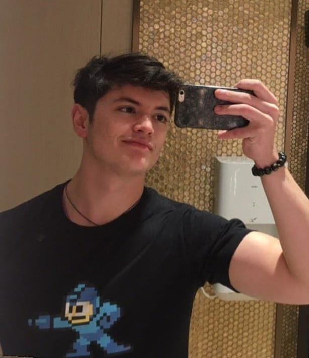

[Home](index.md) | [Research](research.md) |[CV](https://jespigno.github.io/CV%20Jose.pdf) | [LinkedIn](https://www.linkedin.com/in/jespigno/) | [Github](https://github.com/jespigno) 

{: style="float: left; margin-right: 1em;"}

Hi, I am José, a second-year Computer Engineering Student at the University of Hong Kong.

My interests include Natural Language Processing, Electronic Circuits, Machine Learning, and Software Design.

I am the member of HKU Rowing team, part of HKU BREED (Biomimicry Robotics Team) and Student Ambassador in HKU.

I am currently looking for internships and research opportunites in Hong Kong.

My email is jespigno (at) connect.hku.hk

